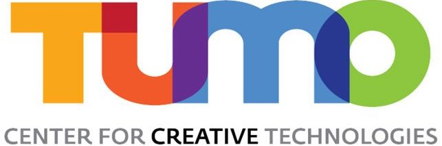

# TUMO workshop - Analyzing Armenian Materials with AI

This Git contains main code and tasks for the TUMO workshop "Analyzing Armenian Materials with AI", led by Chahan Vidal-Gorène (Calfa) and Baptiste Queuche (Calfa).

    

## Week 1: People Detection in Armenian Newspapers

**Goal**: Localizing people in Armenian Newspapers of the 20th century. You will learn how to perform *semantic segmentation* and *object detection* in a structured document, with Mask-RCNN.

Full instructions: see [week 1](week1/README.md).

In partnership with the [Fundamental Scientific Library of the National Academy of Sciences of the Republic of Armenia](https://www.flib.sci.am/index.php/en/knowledge/).
