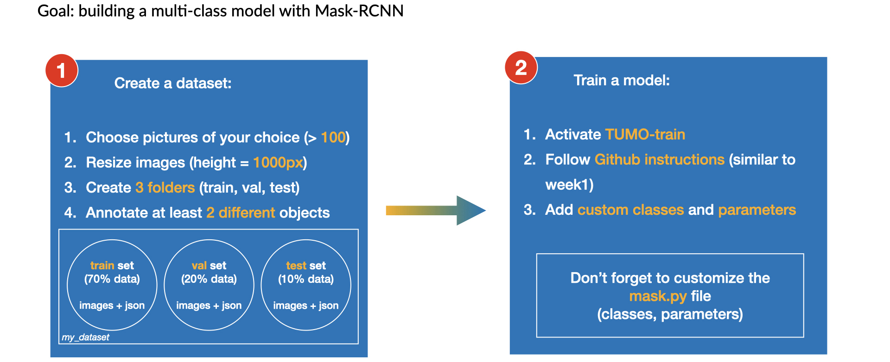

# Week 2 of the workshop

# Table of contents

1. [Just for fun](#bonus)

2. [Task 1 - Introduction to a multi-class problem](#task1)

    1. [Building a custom dataset](#dataset)

    2. [Training (TUMO-train)](#training)

    3. [Prediction (TUMO-pred)](#prediction)

3. [Task 2 - Live Demo and Video detection](#task2)


## 1. Just for fun - Apply your last newspaper model to a street view image <a name="bonus"></a>

```bash
conda activate TUMO-pred
jupyter notebook
```

And use the notebook ```demo.ipynb```, similar to the one we have use during week1 to run your last model on new images (it's in Mask-RCNN-TF2-3.0/samples/).

> What do you think about the results?


## 2. Task 1 - Introduction to a multi-class problem<a name="task1"></a>

<p align="center">

</p>


### Building a custom dataset<a name="dataset"></a>

The first step consists in building a customized dataset with at least two different objects to recognize (up to 4).

You can use data of your choice (images from internet, images from the [Fundamental Scientific Library of the National Academy of Sciences of the Republic of Armenia](https://www.flib.sci.am/index.php/en/knowledge/), or you can also use the **dataset we provide below**.

===========
Google Drive with some data : [access to Data](https://drive.google.com/drive/folders/1HtCaCthql443kRR-bAD2RjarF7wHqSst?usp=sharing)
===========


1. Download your images in a folder ```my_dataset_week2```.
2. Resize images to a height of 1000px.
3. Split into 3 folders (train, val, test).
4. Annotate images with the objects of your choice, with the **polygon** function.

**For annotating your dataset, we will use our [annotator tool v2.0.11](../annotator).**


5. Export annotations as json and save the json file into each folder (train, val, test) with the name ```via_region_data```.


### Training (TUMO-train)<a name="training"></a>

```bash
conda activate TUMO-train
```

Open the file:
```
Mask-RCNN-TF2-3.0/samples/custom/custom.py
```

Update the classes according to your dataset:

```line 85```: add as much classes as necessary, with the name you have used during your annotation.
```python
self.add_class("object", 1, "name1") #for instance : name = car
self.add_class("object", 2, "name2") #for instance : name = people
#self.add_class("object", 3, "name3") #uncomment if you have more than 2 classes
#self.add_class("object", 4, "name4") #uncomment if you have more than 3 classes
```

and around ```line 124```, add correct informations:
```python
name_dict = {"name1": 1, "name2": 2} #if you have more than 2 classes, don't forget to add name3 and name4
```

And finally, you can launch training:

```bash
cd Mask-RCNN-TF2-3.0/samples/custom
python3 custom.py train --dataset=/absolute/path/to/your/dataset --weights=coco
```

In case of errors:

```bash
conda install -c conda-forge opencv 
```


### Prediction (TUMO-pred)<a name="prediction"></a>

```bash
conda activate TUMO-pred
pip install pycocotools
jupyter notebook
```

And open the notebook ```custom_model.ipynb``` (Mask-RCNN-TF2-3.0/samples/custom).


## 3. Task 2 - Live Demo and Video detection<a name="task2"></a>


**Choose some newspapers and street views**

We are working with:
**TUMO-pred** and **demo.ipynb**

To create GIF file, add in your notebook demo :

```python
import glob
from PIL import Image
def make_gif(frame_folder):
    frames = [Image.open(image) for image in glob.glob(f"{frame_folder}/*.png")]
    frame_one = frames[0]
    frame_one.save("my_awesome.gif", format="GIF", append_images=frames,
               save_all=True, duration=600, loop=0)
```

and then run :

```python
make_gif("/video/output/path/with/your/predicted/images")
```

If doesn't work, install Pillow in TUMO-pred:

```bash
python3 -m pip install Pillow
```
